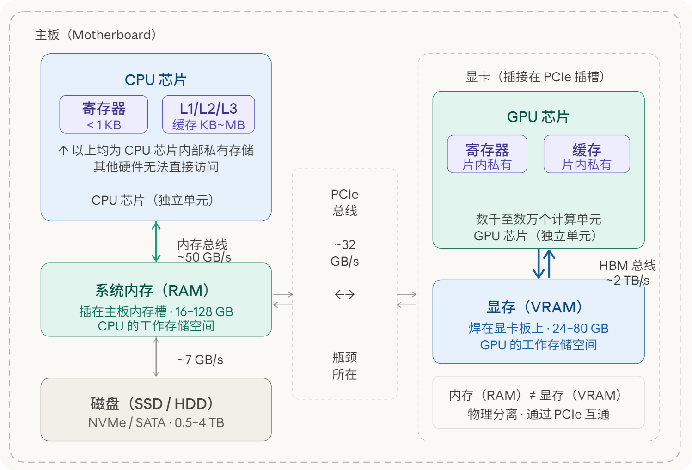
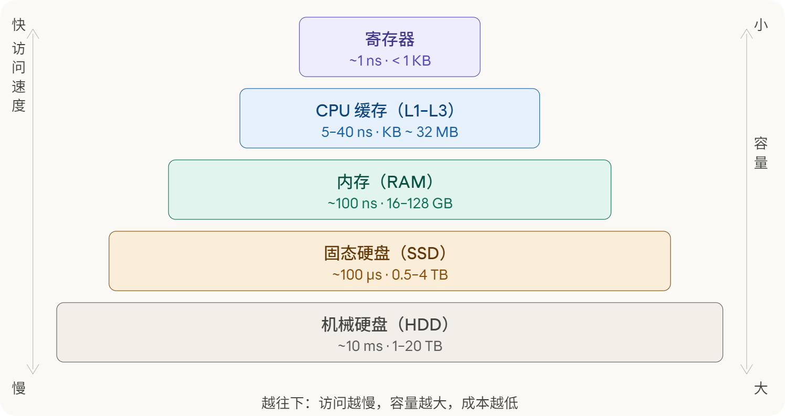
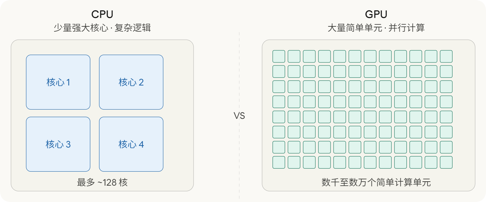
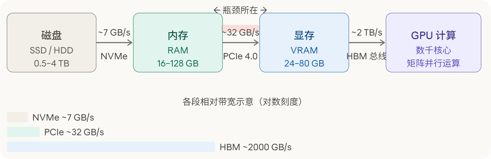
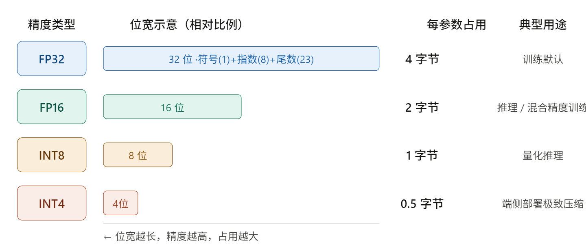
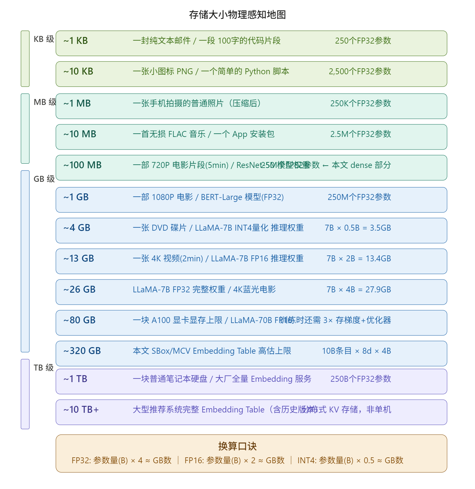
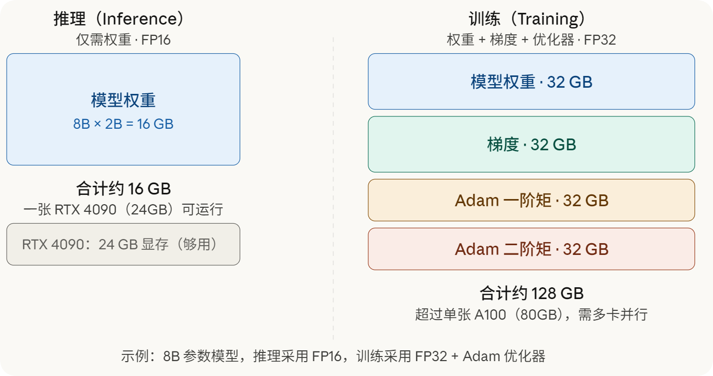

## 理解计算机硬件与大模型的存储逻辑

## 引言

在接触大型语言模型的过程中，我反复遇到一类描述：某个模型有 7B 参数，推理需要 14 GB 显存；另一个模型有 70B 参数，单机无法部署。这些数字对许多研究者而言并不陌生，但背后的逻辑却往往不够清晰。7B 参数是什么意思，14 GB 又是对哪块硬件的要求，这两个问题的答案之间存在怎样的换算关系，实际上涉及计算机硬件架构的基本认知。

本文分两个部分。第一部分梳理计算机的核心硬件组成，依次讨论存储层级、CPU、内存、磁盘、GPU、显存，以及各硬件之间的数据流动路径。第二部分从参数量的计数单位出发，说明如何将参数个数换算为实际存储需求，并结合 8B 模型这一具体案例，说明这些需求分别落在哪块硬件上、对应什么量级的物理空间。

---

## 第一部分：计算机硬件架构的基本认知

### 补充节：计算机硬件的整体拓扑关系

在展开各硬件的具体功能之前，有必要先建立一张整体的结构图，说明各硬件单元是什么、彼此如何连接。

一台计算机的核心硬件由主板连接在一起。主板是一块电路板，CPU、内存条、GPU 等硬件都安装或插接在主板上，通过主板上的总线互相通信。

CPU 是一块独立的处理器芯片，焊接或插接在主板的 CPU 插槽上。CPU 芯片内部集成了寄存器和三级缓存（L1、L2、L3），这些存储单元是 CPU 私有的，其他硬件无法直接访问。CPU 通过内存控制器与内存条相连，内存条插在主板的内存插槽上，这就是通常所说的内存（RAM）。内存由 CPU 主导管理，是 CPU 读写数据的主要工作区域。

GPU 同样是一块独立的处理器芯片，通常以显卡的形式插接在主板的 PCIe 插槽上。GPU 芯片内部同样集成了自己的寄存器和缓存，GPU 的显存（VRAM）焊接在显卡电路板上，紧邻 GPU 芯片，通过高带宽总线与 GPU 直连。显存与系统内存在物理上完全分离，互不归属。

因此，当文章中提到内存，指的是系统内存（RAM），即 CPU 侧的工作存储空间，而非显存。两者虽然都是随机存取存储器，但位置、带宽和归属完全不同。

CPU 与 GPU 之间通过 PCIe 总线通信。CPU 可以指示 GPU 执行计算任务，也可以将数据从系统内存搬运至显存，但这一传输过程受 PCIe 带宽限制，速度远低于 GPU 在显存内部的读写速度。

下图展示了上述各硬件单元的物理位置与连接关系。

这张图所揭示的核心关系可以用一句话概括：CPU 和 GPU 是主板上两块独立的处理器芯片，各自拥有片内私有的缓存与寄存器，以及对应的外部工作存储空间。CPU 对应的是系统内存，GPU 对应的是显存。两侧的存储空间物理隔离，数据在二者之间流转必须经过 PCIe 总线，这条总线的带宽约为每秒 32 GB，是整条数据链路中最窄的一段。文章后续提到内存，均指 CPU 侧的系统内存，与显存无关。

### 第一节：存储层级的基本结构

计算机内部存在多种存储介质，它们在访问速度和存储容量上存在数个数量级的差异。理解这一差异，是理解后续所有内容的起点。

最快的存储单元是寄存器，位于 CPU 芯片内部，访问延迟约为 1 纳秒，但容量极小，通常只有数百字节。紧随其后的是 CPU 缓存，分为 L1、L2、L3 三级，同样集成在芯片内或紧邻芯片，容量从几十 KB 到几十 MB 不等，访问延迟约为 5 至 40 纳秒。再下一层是内存，即通常所说的 RAM，一台普通工作站配备 16 GB 至 128 GB，访问延迟约为 100 纳秒，断电后数据消失。最后是磁盘，包括固态硬盘（SSD）和机械硬盘（HDD），容量可达数 TB，但访问延迟分别约为 100 微秒和 10 毫秒，比内存慢三到五个数量级。

这一层级结构遵循一个基本规律：速度越快的存储，单位容量的制造成本越高，因而实际配备的容量越小；速度越慢的存储，成本越低，容量越大。这是物理规律与经济规律共同约束的结果，不存在速度快且容量大的廉价选项。下图以金字塔形式呈现了这五个层级，从顶部到底部对应从快到慢、从小到大的变化。

值得特别说明的是，GPU 拥有自己的独立显存，这是金字塔之外的另一套存储体系。显存在位置和速度上与 CPU 的缓存类似，但服务对象是 GPU 而非 CPU。关于显存的详细讨论，将在第六节展开。

---

### 第二节：CPU 的角色与特点

CPU 是中央处理器（Central Processing Unit）的缩写，承担着计算机中绝大多数通用逻辑的处理工作。理解 CPU，需要把握三个核心特点。

第一，CPU 的核心数量有限。一颗面向消费者的高端处理器通常拥有 8 到 24 个物理核心，面向服务器的处理器可以达到 64 到 128 个核心。这个数量相对于 GPU 而言极为有限，但每个核心的能力极强，能够处理复杂的分支逻辑、条件判断和不规则计算任务。

第二，CPU 的单核性能很强。每个核心都有完整的指令集支持、独立的 L1 和 L2 缓存，并能以极高的频率运行，通常在 3 GHz 至 5 GHz 之间。这意味着 CPU 在处理需要大量顺序判断的任务时表现优异，例如操作系统调度、数据库查询、编译器运行等。

第三，CPU 的并行度相对有限。虽然多核 CPU 可以同时执行多个任务，但核心数量的上限使得大规模并行计算的能力受到约束。当一个计算任务可以被分解为数万个独立的子任务时，CPU 并非最优选择，这正是 GPU 出现并被大量用于深度学习的原因。

此外，CPU 紧密连接内存，程序在 CPU 上运行时，数据和指令都存放在内存中，CPU 以极高的频率读写内存中的数据。操作系统、浏览器、数据处理脚本等日常软件，主要依赖 CPU 完成计算。

---

### 第三节：内存的作用

内存是程序运行时的工作空间。当我们打开一个程序，操作系统会将程序的代码和所需数据从磁盘加载到内存，CPU 随后从内存中读取指令并执行。内存的容量直接决定了计算机能同时处理多大规模的数据，以及能同时运行多少个程序。

内存的一个关键特性是断电后数据消失，这与磁盘的持久化存储形成对比。内存中存放的是当前正在运行的程序和数据，一旦关机，这些内容全部清空，下次启动时需要重新从磁盘加载。

对于大模型而言，内存通常扮演中转站的角色。模型权重文件存储在磁盘上，运行之前需要先将其读入内存，再从内存传输到 GPU 的显存中。这个链路的速度和瓶颈，将在第七节详细讨论。

---

### 第四节：磁盘的作用

磁盘负责持久化存储，所有的文件、模型权重、数据集都长期保存于此，断电后数据不会消失。固态硬盘（SSD）的读写速度约为每秒 3 至 7 GB，机械硬盘（HDD）约为每秒 100 至 200 MB，两者差距约为 30 至 50 倍。

在大模型的使用场景中，磁盘是模型权重的长期仓库。一个 7B 参数的模型，其权重文件大小约为 13 GB（FP16 精度），存放在磁盘上不占用内存或显存资源。只有在需要运行时，才将其从磁盘加载至内存，再进一步传输至显存。磁盘的读取速度，决定了模型从存储到可用状态所需的时间，通常在数十秒的量级。

---

### 第五节：GPU 的角色与特点

GPU 是图形处理器（Graphics Processing Unit）的缩写，最初为图像渲染而设计，后来被广泛用于科学计算和深度学习。GPU 与 CPU 的根本区别在于计算核心的数量和设计理念。

一颗高端 CPU 有 16 至 128 个功能完整的核心，而一颗 GPU 拥有数千甚至数万个简单的计算单元。这些计算单元的单个能力远不如 CPU 核心，无法处理复杂的逻辑分支，但它们可以在同一时刻同时执行大量独立的计算操作。

深度学习的核心运算是矩阵乘法。以两个 1000×1000 的矩阵相乘为例，结果矩阵中的每一个元素都是一行与一列的内积，彼此之间完全独立。GPU 可以将这 100 万个独立计算任务同时分发给数千个计算单元并行处理，而 CPU 只能顺序地逐个或分批次地完成，速度差距可达数十倍甚至数百倍。

下图直观呈现了 CPU 和 GPU 在核心设计上的差异。

GPU 适合并行计算的本质，与其物理结构密切相关。每个小型计算单元的电路设计极为简单，省去了 CPU 核心中用于处理复杂分支预测和乱序执行的大量硬件，将节省下来的芯片面积全部用于增加计算单元的数量。代价是单个计算单元的灵活性极低，只适合执行相同的简单操作。这一特点与矩阵乘法高度契合，因为矩阵乘法的每个子任务都是相同的内积计算。

---

### 第六节：显存与系统内存的区别

GPU 拥有独立的存储空间，称为显存（Video RAM，VRAM），与系统内存在物理上完全分离。显存集成在 GPU 芯片板上，通过高带宽总线与 GPU 的计算单元直接相连，带宽极高。以 NVIDIA A100 为例，其显存带宽约为每秒 2 TB，远超系统内存的每秒 50 至 100 GB。

显存容量是大模型运行的核心约束。一块消费级显卡（例如 RTX 4090）配备 24 GB 显存，专业级 GPU（例如 A100）配备 80 GB 显存，H100 同样配备 80 GB。模型在运行时，其权重、中间激活值和梯度必须全部装入显存，任何超出显存容量的部分都会触发换页或报错，导致运行失败。

有一类 GPU 不配备独立显存，而是与 CPU 共用系统内存，通常称为集成显卡或共享 GPU。笔记本电脑中常见的 Intel 核显和 AMD Radeon 集显属于这一类。由于系统内存的带宽远低于独立显存，共享 GPU 在大规模矩阵计算上的性能比独立 GPU 低一至两个数量级，不适合训练或推理大型模型。Apple Silicon（如 M3、M4 系列）是一个特殊情况，其采用统一内存架构，CPU 和 GPU 共享同一块高带宽内存，带宽约为每秒 400 GB，性能介于标准集成显卡和入门级独立显卡之间，可以在内存充足时运行中等规模的模型。

---

### 第七节：各硬件之间的数据流动

各硬件之间并非孤立运作，而是通过数据传输路径紧密连接。理解这一传输链路，有助于定位实际部署中的速度瓶颈。

模型运行的数据流动路径如下：模型权重文件首先存储在磁盘（SSD 或 HDD）上，用户发起推理请求时，操作系统将权重文件从磁盘读入系统内存，随后 CPU 通过 PCIe 总线将数据从系统内存传输到 GPU 的显存，GPU 在显存中完成矩阵计算，最终将结果返回至 CPU 和内存，再输出给用户。

PCIe 总线是这一链路中的关键瓶颈。以 PCIe 4.0 ×16 规格为例，其双向带宽约为每秒 32 GB，而 GPU 显存内部的带宽高达每秒 2 TB，差距约为 60 倍。这意味着，将数据从内存搬运到显存的速度，远低于 GPU 在显存内部读写数据的速度。这一差距使得在可能的情况下，将数据预先装入显存并尽量减少跨 PCIe 传输，成为工程优化的重要方向。

下图展示了从磁盘到 GPU 计算的完整数据流动路径，每一段标注了对应接口的典型带宽。

如图所示，HBM（High Bandwidth Memory）总线的带宽约为 PCIe 的 60 倍。这意味着 GPU 在显存内部读写数据的速度，远超其从系统内存获取数据的速度。因此，一旦模型权重成功装入显存，GPU 的计算效率便可以得到充分发挥；而将权重从内存搬运至显存的这一步骤，是启动推理时不可绕过的时间开销。

---

## 第二部分：大模型的参数量与存储

### 第八节：参数量的计数单位

讨论大模型时，常见的描述是"7B 参数"或"70B 参数"。这里的 K、M、B 是参数个数的计量单位，与存储容量的单位 KB、MB、GB 属于不同体系。

三个计数单位的含义如下。K 代表 Kilo，即千，1K 等于 1000。M 代表 Million，即百万，1M 等于 1000K，即 100 万。B 代表 Billion，即十亿，1B 等于 1000M，即 10 亿。因此，7B 参数的含义是 70 亿个参数，而非 70 亿字节的存储量。

这两套单位之间还存在一个细节差异。存储单位采用二进制定义，1 KB 等于 1024 字节，1 MB 等于 1024 KB。而参数计数单位采用十进制定义，1K 精确等于 1000，1M 精确等于 100 万。在工程计算中，通常忽略这一差异，直接用十进制进行粗略换算，误差约为 7%，对于量级判断而言完全可以接受。

---

### 第九节：每个参数的存储大小

明确了参数个数之后，需要引入另一个变量：每个参数占用多少字节的存储空间。这取决于参数所采用的数值精度，即用多少个二进制位来表示一个浮点数。

目前最常见的精度类型有以下几种。FP32 是单精度浮点数，每个参数占用 32 位，即 4 字节，是模型训练的默认精度，数值范围和精度最高。FP16 是半精度浮点数，每个参数占用 16 位，即 2 字节，常用于推理和混合精度训练，精度有所下降但通常对模型效果影响不大。BF16 与 FP16 同为 2 字节，但数值范围更大，在训练中被广泛使用。INT8 是 8 位整数，每个参数占用 1 字节，常用于量化后的模型推理，精度损失较 FP16 更大。INT4 每个参数仅占 0.5 字节，即 4 位，是当前端侧部署中常见的极致压缩方案。

下图直观展示了不同精度下每个参数的位宽，以及对应的典型使用场景。

---

### 第十节：参数量换算为文件大小

掌握了参数个数与每个参数的字节数之后，便可以进行换算。换算公式为：

存储大小（字节）= 参数个数 × 每个参数的字节数

基于此，可以推导出几个实用的计算口诀。在 FP32 精度下，参数量（以 B 为单位）乘以 4，近似得到 GB 数。在 FP16 精度下，参数量乘以 2，近似得到 GB 数。在 INT4 精度下，参数量乘以 0.5，近似得到 GB 数。

为建立对这些数字的物理感知，可以将模型文件大小与日常生活中常见的文件作比较。一封纯文本邮件约为 1 至 10 KB，对应数千个 FP32 参数。一张手机拍摄的照片（JPEG 压缩后）约为 3 至 5 MB，对应数百万个 FP32 参数。一首无损音质的音乐文件约为 30 至 50 MB，对应约 1000 万个参数。一部 1080P 电影约为 8 至 15 GB，这已经接近一个 4B 参数 FP16 模型的权重大小。一块普通笔记本电脑的固态硬盘容量约为 512 GB 至 1 TB，而一个完整推荐系统的 Embedding 表通常在这个量级。

以具体型号为参照：ResNet-50 是计算机视觉领域的经典模型，参数量约为 25M，FP32 权重文件约为 100 MB，相当于二三十张高清照片的总大小。BERT-Base 的参数量约为 110M，FP32 权重约为 440 MB，相当于几部无损音乐专辑。GPT-2 的参数量约为 1.5B，FP32 权重约为 6 GB，相当于一部 4K 蓝光电影。这些比较有助于形成对不同规模模型的具体感知，而不是停留在抽象的数字层面。

---

### 第十一节：以 8B 模型为例的完整解读

以目前广泛使用的 8B 参数量级模型（如 Meta 的 LLaMA-3 8B）为例，进行完整的存储需求分析。

首先是参数个数。8B 代表 80 亿个参数，即 8,000,000,000 个独立的浮点数，每个参数代表模型权重矩阵中的一个数值。

其次是精度选择与存储大小。在 FP32 精度下，该模型的权重文件大小为 8 × 4 = 32 GB。在 FP16 精度下，大小为 8 × 2 = 16 GB。在 INT4 精度下，大小约为 8 × 0.5 = 4 GB。目前主流的推理框架通常默认采用 FP16，因此常见的说法是 8B 模型需要约 16 GB 显存。

然而，这 16 GB 究竟对哪块硬件提出要求，是一个关键问题。答案是显存，而非磁盘或系统内存。模型权重文件可以存放在磁盘上，占用磁盘的 16 GB 空间；加载至系统内存时，同样占用内存的 16 GB 空间；但要实际运行推理，权重必须完整地进入 GPU 的显存。如果 GPU 的显存容量不足 16 GB，推理便无法进行，或只能通过 CPU 卸载等方式以牺牲速度为代价绕过这一限制。

训练时的显存需求远高于推理。除了存储模型权重本身，训练还需要存储每个参数对应的梯度，以及优化器的状态。以最常用的 Adam 优化器为例，它需要存储每个参数的一阶矩（动量）和二阶矩（自适应学习率），各占一份参数大小的空间。因此，训练时的总显存需求约为权重的 4 倍，即 8B 模型在 FP32 精度下训练需要约 128 GB 显存，超出了单张 A100（80 GB）的容量，通常需要多卡并行或使用显存优化技术。

下图以对比形式展示了推理与训练时的显存构成。

---

### 第十二节：模型加载的完整链路

了解显存需求之后，还需要理解模型从存储到可用状态的完整加载过程，以及这一过程中各阶段的速度差异。

第一步是从磁盘读取权重文件。以配备 NVMe 固态硬盘的服务器为例，读取速度约为每秒 7 GB。一个 16 GB 的 FP16 权重文件，读取时间约为 2 至 3 秒。如果使用机械硬盘，读取速度约为每秒 150 MB，同一文件的读取时间将延长至约 100 秒以上。

第二步是将权重从内存传输至显存。这一步通过 PCIe 总线完成，带宽约为每秒 32 GB。传输 16 GB 的权重约需 0.5 秒。

第三步是 GPU 在显存中完成模型初始化，准备接受推理请求。这一步的时间相对较短，通常在数百毫秒以内。

整个加载链路的主要时间开销在第一步，即磁盘读取。这解释了为什么在初次启动一个大型模型时，等待时间通常在数秒至数分钟不等，而一旦加载完成，单次推理的延迟则可以控制在秒级以内。在部署场景中，常见的优化策略是将模型保持常驻显存，避免每次请求时重复加载，以换取更低的推理延迟。

此外，当显存不足以容纳完整的模型权重时，一些框架支持将部分权重卸载至系统内存甚至磁盘，按需换入显存。这种方式可以在有限硬件上运行较大的模型，但代价是大量数据在 PCIe 总线上来回传输，推理速度会显著下降，通常只适合实验性场景而非生产部署。

---

## 结语

从存储层级金字塔到 GPU 显存，从参数计数单位到具体的字节换算，本文试图在计算机硬件与大模型部署之间建立一条清晰的认知路径。

几个核心结论值得在此重申。存储层级的速度与容量之间存在固有的反比关系，越接近计算单元的存储越快，但越小也越贵。GPU 的并行优势来源于大量简单计算单元的同时运作，而非单核性能的提升，这与深度学习的矩阵运算结构高度契合。参数量是计数单位，存储大小需要乘以每个参数的字节数才能得到，两者之间差了一个精度选择的变量。8B 模型的 16 GB 显存需求，是对 GPU 显存的要求，而非磁盘或内存，三者的作用各不相同。训练时的显存需求约为推理的 4 倍，这是优化器状态和梯度存储叠加的结果。

建立这套认知框架之后，面对一个陌生的模型规格，便可以快速判断其部署所需的硬件配置，以及在现有资源条件下选用何种精度方案，从而在研究工作中做出更为准确的硬件资源决策。