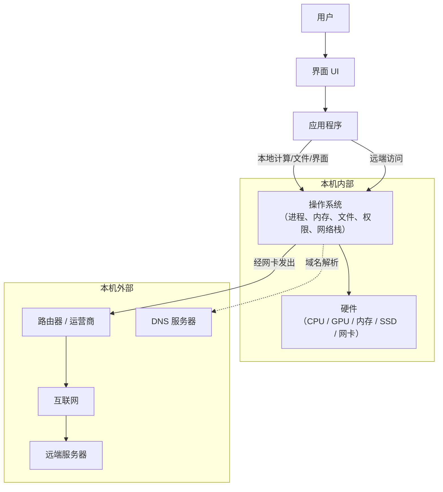
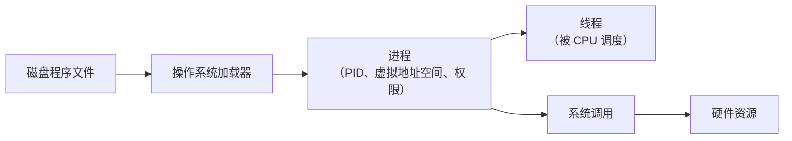
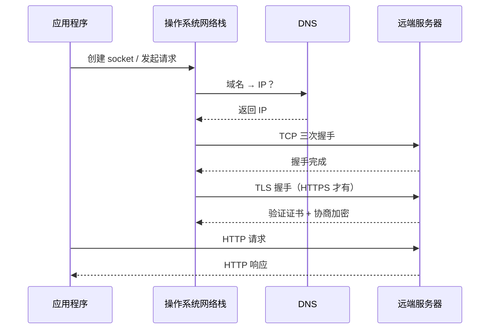
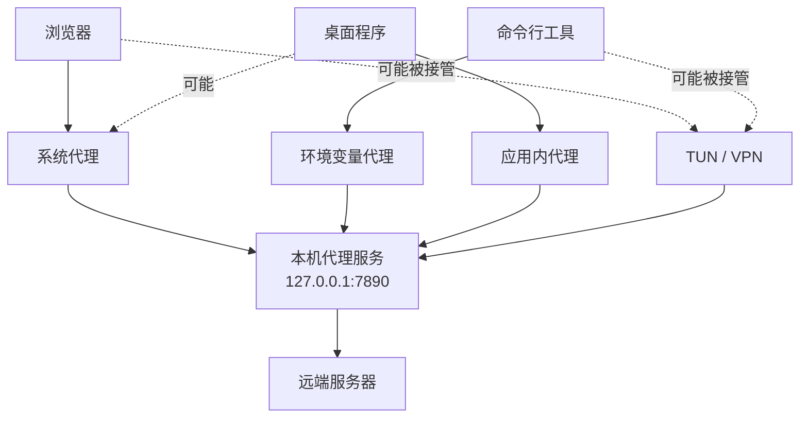
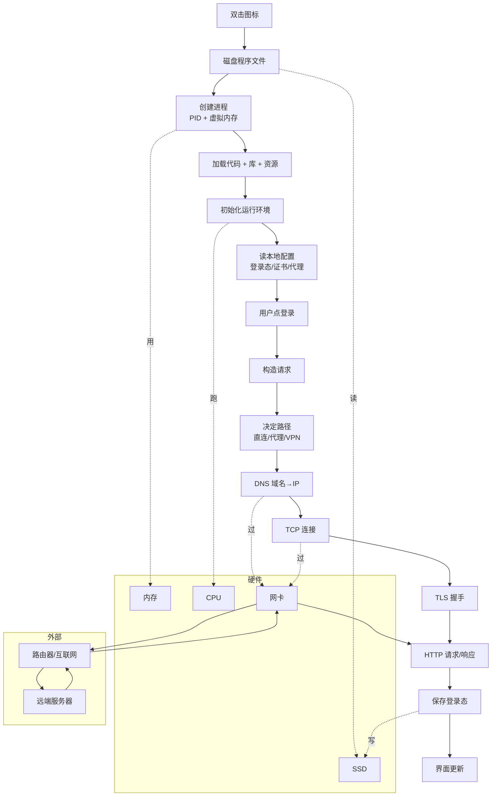

# 计算机系统三大核心模块学习笔记：硬件、操作系统与计算机网络

> 面向非计算机专业学习者。目标不是成为芯片设计师、操作系统内核工程师或网络协议专家，而是建立一套**能解释现实问题**的整体框架。读完之后，你应该能从一次"登录失败"或"程序卡顿"中，看出问题落在哪一层。

## 第一部分：总览与学习目标

### 1.1 三大模块在系统里的位置

很多人一开始就被一个问题绊住：**硬件、操作系统、网络是不是三种平行的东西？**

不是。它们的层级关系是这样的：

```text
应用程序   ← 你看得见的窗口、按钮、命令行结果
   │
操作系统   ← 看不见的"经理"，把硬件资源分给应用程序
   │
计算机硬件 ← 真实的物理部件：CPU、内存、SSD、网卡……
```

而**网络**横跨两端：本机这一侧，它是操作系统里的一段代码（网络栈）+ 一块硬件（网卡）；本机之外，它是路由器、运营商、DNS 服务器、远端服务器组成的外部基础设施。所以"网络"既不只是软件也不只是硬件，而是：

```text
网络 = 协议规则 + 操作系统实现 + 网络硬件 + 外部通信基础设施
```

这就是为什么"网络问题"最难排查 —— 它能在任何一层出错。

### 1.2 一个程序在跑的时候，到底涉及哪些东西

任何一个真实程序都同时走两条路径：

```text
本地运行路径：
用户 → 应用程序 → 操作系统 → 本机硬件（CPU/内存/磁盘/GPU）

远端通信路径：
应用程序 → 操作系统网络栈 → 网卡 → 路由器 → 互联网 → 远端服务器
```

打开 VS Code → 走第一条；登录账号、同步插件 → 同时走两条。**两条路径不是分开的，而是穿插在同一个程序里。**

### 1.3 各层各自解决什么问题

| 层级       | 它解决的问题                                       |
| ---------- | -------------------------------------------------- |
| 硬件       | 凭什么能算、能存、能传                             |
| 操作系统   | 多个程序如何安全、稳定、共享地使用硬件             |
| 网络       | 程序如何和本机外的服务通信                         |
| 应用程序   | 用户的具体任务怎么被表达和执行                     |

下面给出整体图：



### 1.4 三个"接口"

理解整个系统时，抓住三个"看不见的接口"：

| 接口     | 谁和谁之间             | 例子                            |
| -------- | ---------------------- | ------------------------------- |
| 用户界面 | 用户 ↔ 应用程序        | 按钮、命令、图形界面            |
| 系统接口 | 应用程序 ↔ 操作系统    | 打开文件、申请内存、创建 socket |
| 网络协议 | 本机程序 ↔ 远端服务    | DNS、TCP、TLS、HTTP             |

用 Python 一行代码举例：

```python
requests.get("https://example.com")
```

它在底下其实经过：

```text
Python 代码
  → urllib / ssl / socket（语言库）
  → 操作系统 socket API（系统接口）
  → 操作系统网络栈（TCP/IP 实现）
  → 网卡（硬件出口）
  → 外部网络 → 远端服务器
```

### 1.5 普通开发者最该记住的三句话

1. **程序不是直接跑在硬件上的**，它是被操作系统"托管"成进程才能跑。
2. **网络请求不是凭空发出去的**，它要经过操作系统网络栈、网卡和外部网络。
3. **性能和故障常常不是单点问题**，是计算、存储、网络、配置共同决定的结果。

记住这三句话，能解释下面这些怪现象：

- 终端里 `export HTTPS_PROXY=...` 影响 Python，却影响不了双击启动的桌面软件；
- 浏览器能上网，IDE 却报 `ECONNREFUSED 127.0.0.1:7890`；
- GPU 跑分很高，但训练慢在 SSD 读数据；
- VPN 显示已连接，可某个软件还是登不上。

---

## 第二部分：计算机硬件 —— 计算机"能算"的物理基础

### 2.1 硬件层有哪些东西，分别是实体还是概念

学硬件最容易乱在一点：**有些东西是看得见摸得着的实体，有些是工程师为了管理实体而引入的抽象概念。** 先把它们分清：

| 类别          | 名称              | 性质         | 是什么                              |
| ------------- | ----------------- | ------------ | ----------------------------------- |
| 物理基础      | 晶体管            | 实体         | 芯片里的纳米级电子开关              |
| 物理基础      | 逻辑门            | 实体（电路） | 由若干晶体管组成的小电路            |
| 计算单元      | CPU               | 实体（芯片） | 通用处理器                          |
| 计算单元      | GPU               | 实体（芯片） | 并行处理器                          |
| 存储设备      | 内存（RAM）       | 实体（芯片） | 易失性高速存储                      |
| 存储设备      | SSD / 硬盘        | 实体         | 非易失性持久化存储                  |
| 通信设备      | 网卡 / Wi-Fi 模块 | 实体         | 把数据收发出去的硬件                |
| 通信设备      | 总线 / PCIe       | 实体（线路） | 部件之间的数据高速公路              |
| 数字抽象      | 0 / 1             | 概念         | 把电压解释成两个离散值              |
| CPU 内部抽象  | 指令              | 概念         | CPU 能识别的一条操作                |
| CPU 内部组件  | 寄存器            | 实体（电路） | CPU 内部最小最快的存储              |
| 性能概念      | 带宽 / 延迟       | 概念         | 数据传输的"宽度"和"等待时间"        |

下面按"从最底层到最上层"讲一遍。

### 2.2 最底层：从电信号到 0/1

**晶体管**是芯片里的"电子开关"。一颗现代 CPU 含几百亿个晶体管。把一组晶体管接好线，就成了**逻辑门**（AND、OR、NOT），能做最基础的布尔运算。

但物理世界的电压是连续的（可能是 0.01V、0.72V、1.03V）。如果直接拿连续值当数据，一点电磁干扰就会出错。所以数字电路做了一个"取舍"：

```text
低电压区间 → 一律当成 0
高电压区间 → 一律当成 1
中间过渡区 → 电路设计成不让信号停在这里
```

这就是 **0/1 抽象**。它牺牲了表达精度，换来了极高的稳定性、可复制性、可组合性。**整个数字计算大厦都建在这个抽象之上。**

逻辑门可以堆出两类电路：

- **组合逻辑**：输出只看当前输入。例：加法器。
- **时序逻辑**：输出还看历史状态。例：寄存器、计数器。

时序逻辑是关键 —— 有了它机器才能"按步骤执行"，而不只是"算一下"。

### 2.3 计算单元：CPU 与 GPU

#### CPU：通用计算和控制中心

CPU 干的事可以浓缩成一个永不停歇的循环：

```text
取指令 → 解码 → 执行 → 读写数据 → 更新状态 → 取下一条指令
```

CPU 内部由几个关键部件组成（这些都是实体电路，但平时我们只在概念层用它们）：

- **控制单元（CU）**：解释指令、协调执行节奏
- **算术逻辑单元（ALU）**：做加减、与或非、比较
- **寄存器**：CPU 内部最快的小容量存储，暂存当前用到的数据和地址
- **缓存（L1/L2/L3）**：比内存快得多，缩短"取数据"的等待

CPU 擅长的场景特点：分支多、依赖强、流程复杂。例如：

```text
如果 token 过期 → 重新认证
否则如果网络错 → 重试
否则 → 显示主页
```

这种代码每一步都要看上一步结果，无法大规模并行。CPU 用复杂的分支预测、乱序执行等机制来加速这类工作。

#### GPU：大规模并行计算

GPU 最初为图形渲染而生 —— 屏幕上几百万像素的计算高度同质，可以并行算。这个特性后来恰好契合深度学习。

GPU 的设计哲学和 CPU 相反：

| 维度       | CPU                       | GPU                           |
| ---------- | ------------------------- | ----------------------------- |
| 核心数量   | 少，但每个很复杂          | 多，但每个相对简单            |
| 设计目标   | 单线程低延迟、复杂控制    | 大规模并行高吞吐              |
| 擅长任务   | 操作系统、业务逻辑、脚本  | 矩阵运算、图像处理、深度学习  |
| 典型瓶颈   | 缓存、分支、内存延迟      | 数据搬运、显存容量            |

#### 为什么"有强 GPU"不等于"系统快"

大模型训练系统真正的瓶颈往往不在 GPU 本身，而在：

- 模型参数能不能塞进显存；
- 数据从 SSD → 内存 → 显存的搬运够不够快；
- 多 GPU 之间通信带宽够不够；
- CPU 能不能及时把下一批数据准备好；
- 网络能不能跟上分布式梯度同步。

**GPU 强 ≠ 整体快。整体快取决于最短的那块板。**

### 2.4 存储层级：内存与 SSD

存储不是只有"一种"，它是个金字塔：

```text
寄存器        ← 最快、最贵、最少（CPU 内部）
   ↓
缓存 L1/L2/L3 ← 很快（CPU 内部）
   ↓
内存（DRAM） ← 快，断电消失（运行时数据）
   ↓
SSD / 硬盘   ← 慢得多，断电保留（持久化文件）
   ↓
远端存储     ← 最慢（云盘、对象存储）
```

**关键区别：内存断电就消失，SSD/硬盘断电保留。**

所以程序运行的典型流程是：

```text
SSD 上的文件 → 加载到内存 → CPU/GPU 计算 → 结果写回 SSD
```

数据**永远在搬运**。这就是为什么"算力强"不等于"性能高" —— 算得再快，没数据可算也是干等。

### 2.5 数据通道：总线、带宽、延迟

**总线 / 互连**（实体）是部件之间的"数据高速公路"：内存总线连 CPU 和内存，PCIe 连 CPU 和 GPU/SSD，网络链路连本机和外部。

衡量这些通道有两个概念（注意它们是不同的）：

- **带宽**：单位时间能传多少数据。类比"道路有多宽"。
- **延迟**：一次请求从发出到回来要多久。类比"门到门需要多久"。

**带宽高 ≠ 延迟低。** 大文件传输关心带宽；高频小请求更怕延迟。

### 2.6 真实系统的常见瓶颈

写程序时很容易以为"瓶颈是计算"，但实际上：

- CPU 在等内存
- GPU 在等数据从内存拷贝到显存
- 程序在等 SSD 读
- 网络请求在等 DNS / TCP / TLS / 服务器
- 多线程程序在等锁
- 大模型推理在等显存带宽，而不是计算单元

所以做性能分析时永远先问：

```text
瓶颈在计算、内存、存储、网络，还是同步等待？
```

### 2.7 硬件层小结

硬件层的本质是：**把物理电信号组织成可靠的数字计算、存储、传输系统。** 它向上提供四类能力：

```text
计算能力：CPU（通用） + GPU（并行）
存储能力：内存（运行时） + SSD（持久化）
通信能力：总线（机内） + 网卡（机外）
```

这些能力本身是"裸"的 —— 操作系统的工作就是把它们包装成程序能安全使用的资源。

---

## 第三部分：操作系统 —— 程序如何被运行起来

### 3.1 操作系统层有哪些东西，分别是实体还是概念

操作系统本身是一段运行在硬件上的特殊程序。它管理的"对象"分两类：

- **实体资源**：物理存在，操作系统帮你分。比如 CPU 时间片、物理内存页、磁盘块、网卡。
- **抽象概念**：操作系统**虚构**出来，让程序用起来更方便、更安全。比如进程、线程、虚拟地址空间、文件、socket。

| 名称              | 性质                 | 实质                                 |
| ----------------- | -------------------- | ------------------------------------ |
| 程序              | 实体（文件）         | 磁盘上的可执行文件                   |
| 进程              | **概念**             | 程序运行起来后的"实例"               |
| 线程              | **概念**             | 进程内部的执行流，CPU 调度的最小单位 |
| 虚拟地址空间      | **概念**             | 操作系统给进程的"内存幻觉"           |
| 物理内存页        | 实体                 | DRAM 上真实的一块内存                |
| 文件 / 目录       | **概念**             | 对磁盘块的友好封装                   |
| 文件描述符 / 句柄 | **概念**             | 对"已打开资源"的引用编号             |
| socket            | **概念**             | 对网络连接的友好封装                 |
| 系统调用          | **概念**             | 应用程序请求内核做事的入口           |
| 用户态 / 内核态   | **概念**（硬件支持） | 权限隔离机制                         |
| 环境变量          | **概念**             | 进程启动时携带的键值对               |

记住这张表的核心：**进程、线程、文件、socket 都是操作系统"造"出来的概念**，硬件里并没有这些东西。

### 3.2 操作系统在做什么

可以把它的工作压缩成三件事：

1. **抽象硬件**：把磁盘抽象成"文件"，把网卡抽象成"socket"，把 CPU 时间抽象成"线程"。
2. **管理资源**：决定谁用 CPU、用多少内存、能开多少文件、能监听哪些端口。
3. **提供保护**：阻止程序 A 乱搞程序 B 的内存，阻止普通程序篡改内核。

### 3.3 程序、进程、线程：三个最容易混的概念

这三个词指三件不同的事：

```text
程序：磁盘上的静态文件（如 chrome.exe）
   │  ← 双击启动
   ▼
进程：操作系统创建的动态实例，有独立的 PID、内存、权限
   │  ← 内部包含
   ▼
线程：真正被 CPU 调度的执行流，可以有一个或多个
```

几个推论：

- 同一个程序可以启动多次 → 多个独立进程。
- 一个进程**至少**有一个线程（主线程），通常有多个。
- 同一进程的多个线程**共享内存**，所以通信方便，也容易出竞态。
- 不同进程的内存**互相隔离**，通信要走专门机制（管道、共享内存、socket 等）。

为什么浏览器要做成多进程？因为一个标签页崩溃只崩它自己的进程，整个浏览器还活着。

### 3.4 进程从无到有：一次启动里发生了什么

双击图标到程序跑起来，操作系统大致做了这些（顺序简化）：

1. 找到可执行文件，检查权限
2. 创建进程，分配 PID
3. 加载代码 + 动态库到内存
4. 建立**虚拟地址空间**（栈、堆、代码段等）
5. 设置环境变量、工作目录、启动参数
6. 创建主线程，调度器开始给它分配 CPU 时间



### 3.5 内存管理：虚拟地址空间、栈与堆

#### 虚拟地址空间是什么

每个进程都看到一片**看起来连续、看起来独享**的内存。这是假象。真实物理内存被操作系统和硬件 MMU（内存管理单元）拼接、复用、按需映射出来。

为什么要做这个假象？

- **隔离**：进程 A 看到的"地址 0x1000"和进程 B 看到的不是同一个物理位置，互不干扰。
- **安全**：用户程序的地址空间不包含内核区，普通程序碰不到内核数据。
- **灵活**：物理内存不够时，可以把暂时不用的页换到磁盘（swap）。

#### 栈 vs 堆

进程的虚拟地址空间里，有两块特别重要：

| 区域 | 用途                                 | 生命周期           | 谁管理               |
| ---- | ------------------------------------ | ------------------ | -------------------- |
| 栈   | 函数调用的局部变量、返回地址         | 函数进入/退出自动 | 编译器/运行时        |
| 堆   | 动态分配的对象、不定大小的数据结构   | 灵活（直到释放）   | 程序自己 / GC 系统   |

直觉记法：

```text
栈：短期、结构清楚、自动管理
堆：长期、大小不定、要么手动释放，要么靠垃圾回收
```

#### 段错误是怎么回事

程序访问没分配给它的地址，操作系统会立刻终止它。表现为段错误（Linux）/访问冲突（Windows）。这**不是系统坏了**，是保护机制正常工作。

### 3.6 文件系统与 I/O

**文件**和**目录**也是操作系统造出来的概念 —— SSD 上其实只有"块"。文件系统把块组织成层级结构，并提供统一接口：

```text
open → read / write → close
```

更妙的是：网络连接、终端、管道、设备……在很多操作系统里都被包装成"类文件"对象，通过同样的接口操作。这是操作系统的核心思想：**用统一抽象屏蔽不同设备的差异。**

I/O 必须由操作系统统一管的原因：

- I/O 设备比 CPU 慢得多，需要驱动协调；
- 多个程序可能同时用同一个设备（屏幕、键盘、网卡）；
- I/O 涉及权限和安全（你不能随便读别人的文件）。

### 3.7 环境变量、权限与配置

#### 环境变量是什么

环境变量是**进程启动时**附在进程身上的一组键值对：

```text
PATH=...
HOME=...
HTTPS_PROXY=http://127.0.0.1:7890
CUDA_VISIBLE_DEVICES=0
```

它们**不是全局广播**，而是**每个进程私有**的。子进程通常继承父进程的环境变量。

#### 为什么"终端里设置的代理"对桌面图标启动的程序不生效

这是个常见困惑，原理其实简单：

```text
你在终端 A 里执行 export HTTPS_PROXY=...
  → 这个变量只属于终端 A 这个 shell 进程
  → 终端 A 启动的子进程（python app.py）会继承
  → 但桌面图标启动的程序，父进程是桌面环境/启动器
  → 跟终端 A 没有亲子关系 → 拿不到这个变量
```

所以：

```text
不是代理"随机失效"，是不同程序读取配置的来源不同。
```

#### 配置的优先级（粗略）

```text
命令行参数 > 应用内配置 > 环境变量 > 用户级配置 > 系统级配置 > 默认值
```

但**最终采用哪一套，完全由程序自己决定**。这就是为什么不存在"一个所有程序都遵守的全局开关"。

#### 工作目录

进程的"工作目录"决定相对路径基准。很多"文件找不到"的报错，不是文件不存在，是程序的工作目录跟你想的不一样。

### 3.8 系统调用：用户态和内核态的边界

普通程序跑在**用户态**，权限受限；操作系统内核跑在**内核态**，能直接碰硬件。两者之间通过**系统调用**通信：

```text
应用程序：「我要读 /tmp/a.txt」
   ↓ 系统调用
内核：检查权限 → 调用文件系统 → 调用磁盘驱动 → 读数据 → 返回
```

常见系统调用类别：

- **文件**：open / read / write / close
- **进程**：fork / exec / wait / exit
- **内存**：mmap / brk
- **网络**：socket / connect / send / recv
- **权限**：getuid / chmod

系统调用是**应用程序和内核之间唯一的合法通道**。它解释了：

- 为什么程序不能随便读任意文件 → 内核会查权限；
- 为什么程序不能监听 1024 以下端口（默认） → 内核要求特权；
- 为什么程序崩溃不会拖垮系统 → 进程在用户态，崩了内核还在。

### 3.9 操作系统层小结

```text
操作系统 = 把硬件能力包装成"可共享、可隔离、可控制"的抽象
```

它造出来的关键抽象：

```text
进程        ← 让"程序"能跑起来且互不干扰
虚拟内存    ← 让每个进程拥有独立的内存视图
文件系统    ← 让磁盘块变成有名字、有权限的文件
socket      ← 让网卡变成可编程的连接
系统调用    ← 让用户程序安全地请求内核做事
```

---

## 第四部分：计算机网络 —— 程序如何连到外面去

### 4.1 网络层有哪些东西，分别是实体还是概念

网络是这本笔记里**最容易概念混乱**的部分，因为它横跨本机内外，且实体和概念交织。先列一张表：

| 名称                 | 位置       | 性质                | 实质                                |
| -------------------- | ---------- | ------------------- | ----------------------------------- |
| 网卡 / Wi-Fi 模块    | 本机内     | 实体                | 把比特变成电磁信号收发出去          |
| 网络栈（TCP/IP）     | 本机内     | **概念**（OS 代码） | 操作系统里实现协议的一段代码        |
| socket               | 本机内     | **概念**            | 应用程序操作连接的"句柄"            |
| 路由器 / 交换机      | 本机外     | 实体                | 网络中转设备                        |
| DNS 服务器           | 本机外     | 实体（服务器）      | 提供"域名→IP"查询服务               |
| 远端服务器           | 本机外     | 实体                | 跑着 web/api/数据库的机器           |
| IP 地址              | —          | **概念**            | 给网络接口的"门牌号"                |
| 域名                 | —          | **概念**            | 给人记的"昵称"                      |
| 端口                 | —          | **概念**            | 一台机器上区分服务的编号            |
| 协议（TCP/HTTP/TLS） | —          | **概念**            | 双方约定的"说话规矩"                |
| 代理 / VPN / TUN     | 因实现而定 | 概念 + 实现         | 改变流量路径的中间机制              |

**关键：路由器、网卡、服务器是实体；IP、端口、域名、协议、socket 都是为了组织通信而约定的概念。**

### 4.2 程序访问远端服务的核心动作

不管多复杂，本质就五步：

```text
找到对方地址 → 建立通道 → 按协议说话 → 接收回复 → 处理结果
```

展开成层次：

```text
应用层：HTTP / API / token
传输层：TCP（可靠） / UDP（轻量）
网络层：IP / 路由
链路 + 物理：网卡 / Wi-Fi / 网线 / 光纤
```

下面按"地址 → 连接 → 加密 → 应用"顺序讲清楚每一层。

### 4.3 地址体系：IP、域名、DNS、端口

#### IP 地址：网络上的门牌号

IP 标识"某台设备上的某个网络接口"。注意：

- 一台电脑可能同时有多个 IP（有线、Wi-Fi、VPN、虚拟网卡各占一个）；
- 家庭网络里，电脑/手机拿到的是**局域网私有 IP**（如 192.168.x.x）；
- 外部网站看到的是你**路由器或运营商网关的公网 IP**，不是你电脑自己的 IP。

格式：

- IPv4：`142.250.190.46`
- IPv6：`2404:6800:4008:c07::8a`

#### 一个 IP 背后可能不止一台机器

常见情况：

- 一个域名解析到多个 IP，用来分摊流量；
- 公网 IP 实际是负载均衡器，后面接很多真实服务器；
- 同一个 IP 上承载多个域名，服务器靠 HTTP `Host` 头或 TLS 的 SNI 区分；
- CDN 让不同地区用户访问到不同的就近节点。

所以"访问 example.com"的真实图景是：

```text
你 → 域名 → 一个公网入口 → 后面可能有一组真实服务器
```

#### 域名：给人记的昵称

```text
www.google.com
api.openai.com
```

域名不能直接拿来连接，必须先翻译成 IP。

#### DNS：从域名到 IP 的翻译

DNS 是个分布式的"全球电话簿"。你访问 `https://example.com`，操作系统先问：

```text
"example.com 的 IP 是？"
```

DNS 失败的话，TCP/TLS/HTTP 一步都还没开始，程序直接报"无法解析域名"。

#### 端口：一台机器上找具体服务

IP 找机器，**端口找服务**。一台服务器同时跑着 web、ssh、数据库……要靠端口区分。

类比：

```text
IP   = 大楼地址
端口 = 大楼里的房间号
服务 = 房间里办事的人
```

常见约定（注意：是约定，不是硬性规定）：

| 端口        | 通常是                |
| ----------- | --------------------- |
| 80          | HTTP                  |
| 443         | HTTPS                 |
| 22          | SSH                   |
| 3306        | MySQL                 |
| 5432        | PostgreSQL            |
| 3000 / 5173 | 本地开发服务器        |
| 7890 / 7897 | 本机代理软件常用端口  |

如果 URL 没写端口，客户端用协议默认值：`http://` → 80，`https://` → 443。

#### 「服务」和「监听端口」是什么意思

"服务"指**正在等待网络请求的程序进程**。比如 nginx、mysql、python flask。

服务程序启动时会向操作系统申请：

```text
bind   → 占住某个 IP + 端口
listen → 进入"等连接"状态
accept → 有客户端连进来时收下
```

如果没有任何程序在监听某端口，去连它就会得到 **"连接被拒绝（Connection Refused）"**。

#### 客户端端口 vs 服务端端口

一次 TCP 连接两边都有端口：

```text
客户端：操作系统临时分配的端口（例如 52341）
服务端：你要连的目标服务端口（例如 443）
```

平时排查问题，主要关心服务端端口是否对、是否有人监听、是否被防火墙拦。客户端临时端口一般不用管。

#### localhost / 127.0.0.1：连自己

`127.0.0.1`（也叫 localhost）是回环地址，表示"本机自己"。所以：

```text
127.0.0.1:7890 → 本机上 7890 端口的服务
```

这通常是代理软件、开发服务器、调试工具。看到 `ECONNREFUSED 127.0.0.1:7890` 的第一反应应该是：

```text
"本机这个端口上是不是根本没程序在跑？"
```

而不是去怀疑远端网站坏了。

### 4.4 通信协议：TCP、HTTP、HTTPS

#### TCP：可靠的字节流通道

TCP 是**操作系统**实现的，应用程序不直接处理它。它解决：

- 怎么建立连接（三次握手）；
- 数据按顺序到达；
- 丢包自动重传；
- 发送太快时减速（流控、拥塞控制）。

应用程序只看到一条"可靠的双向管道"，背后的复杂全藏在内核网络栈里。

#### HTTP：应用层的"对话格式"

HTTP 定义了客户端和服务器**怎么说话**：

```text
请求：方法 + URL + 头部 + 请求体
响应：状态码 + 头部 + 响应体
```

浏览器打开网页、桌面程序登录、Python 调用 API —— 底下基本都是 HTTP。

#### HTTPS = HTTP + TLS

TLS 在 TCP 之上、HTTP 之下加了一层，提供三件事：

- **加密**：中间人看不到内容
- **完整性**：篡改可被发现
- **身份认证**：通过证书链验证服务器

所以 HTTPS 失败可能不是"协议错了"，而是 TLS 握手某一环（证书过期、系统时间错、证书被代理替换）出了问题。

### 4.5 一次完整的网络访问



### 4.6 代理与 VPN：流量改道的几种方式

**先澄清：代理 ≠ VPN。** 它们改流量路径的方式不同。

#### 代理（应用主动改道）

应用程序原本要直接连远端，现在改成先连一个"中间服务"，由它转发：

```text
不用代理：应用 → 远端服务器
用代理：  应用 → 代理服务 → 远端服务器
```

很多桌面代理工具会在本机起个端口（如 `127.0.0.1:7890`），应用连这个本机端口就行：

```text
HTTP 代理 ：处理 HTTP/HTTPS 请求，HTTPS 用 CONNECT 建隧道
SOCKS 代理：更通用，工作在更低层，能代理多种 TCP（部分支持 UDP）
```

#### VPN / TUN（系统层接管）

VPN 和 TUN 模式是在**系统网络层**建一条隧道，把"所有"或"按规则匹配"的流量导走。**应用程序甚至不知道 VPN 存在**，它以为自己在直连。

```text
HTTP/SOCKS 代理：应用主动把请求交给代理（应用知情）
TUN / VPN     ：系统在更底层把数据包改道（应用不知情）
```

很多现代工具同时提供这几种模式，所以排查时要分清当前用的是哪一种。

#### 全局模式 / 规则模式 / TUN 模式

- **全局模式**：尽量让所有流量走代理。简单，但可能影响国内服务、局域网。
- **规则模式**：按域名/IP/进程决定直连或代理。更灵活，但规则匹配顺序会影响结果。
- **TUN 模式**：通过虚拟网卡接管 IP 层流量。可以覆盖那些不读系统代理也不读环境变量的程序。

#### 配置来源：为什么不同程序行为不一致

| 配置来源     | 谁会读取                          | 典型例子                           |
| ------------ | --------------------------------- | ---------------------------------- |
| 系统代理     | 浏览器、部分桌面程序、部分系统库  | Windows / macOS 的网络代理设置     |
| 环境变量     | curl / git / npm / Python requests | `HTTP_PROXY` / `HTTPS_PROXY`       |
| 应用内代理   | 应用自己                          | IDE、聊天软件设置页                |
| TUN / VPN    | 操作系统路由 / 虚拟网卡           | 系统层接管，应用不感知             |

所以"浏览器能上、IDE 不能上"不矛盾 —— **它们读的不是同一套配置。**



### 4.7 网络错误的分层定位

排查网络问题的核心是：**搞清楚失败发生在哪一层。**

| 现象                  | 失败发生的层      | 直观含义                                |
| --------------------- | ----------------- | --------------------------------------- |
| 域名解析失败          | DNS               | 还没拿到 IP                             |
| 连接超时              | IP 路由 / 防火墙  | 数据包发出去没回应                      |
| 连接被拒绝            | 端口 / 服务监听   | 主机可达，但端口上没服务                |
| TLS 证书错误          | TLS / 证书 / 时间 | 加密身份验证失败                        |
| HTTP 401 / 403        | 应用层鉴权        | 网络通了，但账号/权限/token 不对        |
| HTTP 404              | 应用层路由        | 服务器收到了，但路径不存在              |
| HTTP 405              | 应用层方法        | 路径在，但 GET/POST 用错了              |
| HTTP 500              | 服务端逻辑        | 服务器内部出错                          |
| 浏览器通、命令行不通  | 配置来源差异      | 系统代理 / 环境变量 / 应用代理不一致    |

具体到 **`ECONNREFUSED 127.0.0.1:7890`**：

```text
含义：程序想把请求交给本机 7890 端口的代理，但本机这个端口没人监听。
```

排查顺序：

1. 代理软件是不是在跑？
2. 它实际监听的端口是不是 7890？（很多软件默认是 7897）
3. 应用配置的代理协议（HTTP/SOCKS）和端口实际类型对不对？
4. 防火墙是不是拦了本机连接？
5. 有没有几个代理配置互相覆盖？

### 4.8 网络层小结

网络不是单一"东西"，它是：

```text
本机内：网络库 + socket + TCP/IP 栈 + 网卡
本机外：路由器 + DNS + 互联网 + 远端服务器
共识层：IP / TCP / UDP / TLS / HTTP / DNS 等协议
```

它让程序能"连到外面去"靠的是：

```text
DNS    把域名变成 IP
IP     把数据导向目标网络
端口   找到目标机器上的具体服务
TCP    提供可靠通道
TLS    提供加密和身份认证
HTTP   表达请求和响应
```

---

## 第五部分：把三者串起来 —— 一次"桌面登录"背后发生了什么

假设你双击一个软件（VS Code、微信、Codex、浏览器都行），输入账号密码，点"登录"。这个简单动作背后：

```text
点击图标
  → 操作系统把程序加载成进程
  → 进程读取本地配置
  → 用户点登录
  → 程序构造请求
  → DNS / TCP / TLS / HTTP 一层层走完
  → 收响应、更新界面、保存登录态
```

下面拆开看每一步谁在做事。

### 5.1 点击图标 → 程序变进程

桌面上的图标只是个**指向可执行文件的快捷方式**，本身是死的。点击触发操作系统：

1. 找到 `.exe` / `.app` / 可执行入口
2. 检查权限
3. 创建进程，分配 PID
4. 加载代码 + 动态库 + 资源到内存
5. 建立虚拟地址空间
6. 设置环境变量、工作目录
7. 创建主线程，让 CPU 开始执行

参与的硬件：SSD 读文件、内存装代码、CPU 跑指令。

注意：复杂软件常常**不止一个进程**。浏览器经常拆成主进程、渲染进程、GPU 进程、网络进程，目的是隔离崩溃和提升安全性。

### 5.2 程序读取它需要的东西

主线程一开始，程序不知道用户是谁、要不要走代理、证书在哪。它会去读：

| 来源       | 例子                                   |
| ---------- | -------------------------------------- |
| 应用配置   | 主题、上次登录账号、缓存路径           |
| 本地凭据   | token、cookie、会话信息                |
| 系统证书   | HTTPS 用的根证书                       |
| 系统代理   | OS 层的网络代理设置                    |
| 环境变量   | `HTTPS_PROXY` 等                       |

关于环境变量和端口的关系（很多人在这绕晕）：

```text
HTTPS_PROXY=http://127.0.0.1:7890
   └─ 变量名     └─ 变量值
                     └─ 这里面才有端口 7890

环境变量 ≠ 端口。
环境变量是"键值对"；端口是"网络地址里的一个数字"。
```

### 5.3 用户点"登录" → 程序开始造请求

业务逻辑大致是：

1. 检查输入
2. 决定登录服务器地址
3. 决定走不走代理
4. 构造 HTTP 请求体
5. 调用网络库

一行 Python 代码：

```python
requests.post("https://api.example.com/login", json=data)
```

底下会展开成：

```text
应用 → 网络库 → socket API → 网络栈 → 网卡 → 互联网 → 服务器
```

### 5.4 DNS：找服务器在哪

```text
"api.example.com 的 IP 是什么？"
```

DNS 这步必须先行 —— 因为下一步 TCP 需要 IP 才能开始。

DNS 受这些因素影响：操作系统 DNS 设置、路由器 DNS、VPN/TUN 的 DNS、本地缓存。

DNS 失败 → 还没到 TCP 就报"无法解析域名"。

### 5.5 决定路径：直连还是代理

| 路径            | 走法                                               |
| --------------- | -------------------------------------------------- |
| 直连            | 应用 → 操作系统网络栈 → 网卡 → 互联网 → 服务器     |
| HTTP/SOCKS 代理 | 应用 → 本机代理端口 → 代理程序 → 服务器            |
| 系统代理        | 程序读系统代理设置 → 走指定代理                    |
| 环境变量代理    | 程序读 `HTTPS_PROXY` → 走指定代理                  |
| TUN / VPN       | 应用以为直连，实际包被系统隧道接管                 |

再次提醒：`127.0.0.1:7890` 不是远端服务器，是你自己机器上的代理程序。

### 5.6 TCP：建一条可靠管道

到目标 IP + 端口（直连是 `api.example.com:443`，走代理是 `127.0.0.1:7890`），三次握手建连接。

TCP 失败的三种典型表现：

- **连接被拒绝**：端口上没服务
- **连接超时**：包发出去没回应，路由/防火墙/代理/服务器问题
- **网络不可达**：本机路由有问题

### 5.7 TLS：加密 + 验证身份（HTTPS 才有）

TCP 通了之后，HTTPS 还要做 TLS 握手：

- 服务器出示证书
- 客户端验证证书：是不是可信机构签的、域名对不对、过没过期、系统时间对不对、有没有被中间人替换

TLS 失败常见原因：系统时间错、企业代理替换证书、证书过期、根证书没装。

### 5.8 HTTP：真正的"登录请求"

TLS 通道建好后，发送：

```http
POST /login HTTP/1.1
Host: api.example.com
Content-Type: application/json

{"username":"...","password":"..."}
```

服务器响应：

| 状态码 | 含义                              |
| ------ | --------------------------------- |
| 200    | 成功                              |
| 400    | 请求格式不对                      |
| 401    | 未认证 / 凭证无效                 |
| 403    | 已识别身份，但被拒                |
| 404    | 路径不存在                        |
| 405    | 请求方法不对                      |
| 500    | 服务器内部错误                    |

**重要观察**：能看到 HTTP 状态码，意味着 DNS、TCP、TLS 都已经走通。问题更可能在应用层，不是"网不好"。

### 5.9 收到响应 → 更新界面 + 写入本地

成功响应里有 token、用户信息、权限等。程序会：

1. 更新界面 —— "登录成功"
2. 写本地：token、缓存、日志（又调回文件系统 → 操作系统 → SSD）

所以一次登录的最后一步**还是落到磁盘**。

### 5.10 三层在这条链路上各做了什么

| 阶段              | 应用程序          | 操作系统                  | 硬件 / 网络          |
| ----------------- | ----------------- | ------------------------- | -------------------- |
| 点击图标          | 等待启动          | 创建进程                  | SSD 读取程序         |
| 进程创建          | 静态变动态        | 分 PID / 虚拟内存 / 权限  | CPU + 内存开始工作   |
| 加载依赖          | 用代码和库        | 加载库 + 映射内存         | SSD 读、内存写       |
| 读配置            | 决定登录/代理/证书 | 提供文件 + 环境变量接口   | SSD 参与读取         |
| 点登录            | 造请求            | 提供 socket 接口          | CPU 跑业务逻辑       |
| DNS               | 请求解析          | 查缓存或问 DNS 服务器     | 网卡可能发查询       |
| TCP / TLS         | 等连接建好        | 网络栈实现协议            | 网卡发包，远端响应   |
| HTTP              | 发请求 / 解响应   | 传输数据                  | 互联网 + 服务器      |
| 保存状态          | 写 token / 缓存   | 文件系统 + 权限检查       | SSD 持久化           |

### 5.11 完整流程图



### 5.12 同样是"登录失败"，可能在哪一层

| 现象                          | 多半在哪                                 |
| ----------------------------- | ---------------------------------------- |
| 程序根本打不开                | 可执行文件 / 动态库 / 权限               |
| 界面打开但状态异常            | 本地配置 / 缓存 / 凭据                   |
| 代理不生效                    | 系统代理 / 环境变量 / 应用代理路径不一致 |
| `ECONNREFUSED 127.0.0.1:7890` | 本机代理端口没人监听                     |
| 域名解析失败                  | DNS                                      |
| 连接超时                      | 路由 / 防火墙 / 代理 / 服务器            |
| TLS 证书错                    | HTTPS 加密 / 证书 / 系统时间             |
| HTTP 401 / 403                | 认证 / 权限 / token / 风控               |
| HTTP 404 / 405 / 500          | 应用层路径 / 方法 / 服务端逻辑           |
| 登录成功但下次丢失            | 本地存储 / 凭据保存失败                  |

排查原则：

```text
程序起来了吗？
配置对吗？
走的是哪条路径？（直连/代理/VPN）
DNS / TCP / TLS / HTTP 走到哪一步？
拿到响应后保存对了吗？
```

---

## 第六部分：最小可用知识框架

### 6.1 最少要记住的核心点

#### 硬件

1. 0/1 是把电压区间抽象出来的，是一切数字计算的基础。
2. CPU 擅长复杂控制和单线程低延迟；GPU 擅长大规模并行。
3. 内存断电消失，SSD 断电保留；数据永远在搬运。
4. 整体性能 = 计算 + 内存 + 存储 + 网络 + 同步，看最短的那块板。

#### 操作系统

1. 程序是磁盘文件，进程是它跑起来的实例，线程是 CPU 调度的执行流。
2. 每个进程有独立的虚拟内存、环境变量、权限和打开的资源。
3. 环境变量是进程私有的，子进程继承父进程；不同启动方式下父进程不同。
4. 应用程序通过系统调用请求内核做事 —— 这是用户态和内核态的唯一桥梁。
5. 操作系统的工作 = 抽象 + 调度 + 隔离 + 保护。

#### 网络

1. 网络不是单一实体，是协议 + 网络栈 + 网卡 + 外部基础设施的组合。
2. DNS 把域名变 IP；IP 找机器；端口找服务。
3. TCP 是可靠管道；HTTPS = HTTP + TLS；TLS 提供加密 + 完整性 + 身份验证。
4. 代理是应用主动改道，VPN/TUN 是系统层接管 —— 是两种不同的机制。
5. 不同程序读不同来源的代理配置（系统代理 / 环境变量 / 应用内 / TUN）。
6. 排查时按层：DNS → TCP → TLS → HTTP，定位失败发生在哪。
7. `127.0.0.1` 是本机自己。

### 6.2 排查问题的标准动作

```text
1. 程序真的跑起来成进程了吗？
2. 它的工作目录、权限、配置文件对不对？
3. 它读的是系统代理、环境变量、还是应用内代理？
4. 目标是本机地址还是远端地址？
5. DNS 通了吗？
6. TCP 连接建立了吗？
7. TLS 证书过了吗？
8. HTTP 状态码说明什么？
9. 整体瓶颈在 CPU / 内存 / 磁盘 / GPU / 网络？
```

总结成一句话：

```text
先分清是程序问题、配置问题、系统问题、网络协议问题、远端服务问题、还是硬件资源问题。
```

### 6.3 长期保留的四个思维框架

#### 框架一：抽象层次

```text
硬件     ← 真实能力
操作系统 ← 受控抽象
网络     ← 跨机器通信
应用     ← 具体任务
```

每层都隐藏了下层的复杂性，但出问题时你必须能向下追踪。

#### 框架二：资源 + 路径

任何程序行为都可以问两件事：

```text
它用了什么资源？
它的数据走了什么路径？
```

#### 框架三：配置来源

```text
命令行参数 > 应用内配置 > 环境变量 > 用户级 > 系统级 > 默认值
```

但**实际优先级看程序怎么写的**。不存在"全局开关"。

#### 框架四：从错误形态判定层次

| 错误形态           | 多半在哪                       |
| ------------------ | ------------------------------ |
| 找不到命令         | PATH / 环境                    |
| 权限不足           | 用户 / 文件权限                |
| 连接被拒绝         | 端口 / 服务监听                |
| 连接超时           | 路由 / 防火墙 / 代理           |
| 证书错误           | TLS / 时间 / 证书链            |
| HTTP 4xx           | 应用层鉴权 / 路由              |
| HTTP 5xx           | 服务端逻辑                     |
| 程序慢             | CPU / 内存 / 磁盘 / 网络 / 锁  |

---

## 第七部分：推荐参考资料

按"先建框架、后查问题"使用即可。

### 硬件与计算机组成

1. [Computer Systems: A Programmer's Perspective (CS:APP), Bryant & O'Hallaron](https://csapp.cs.cmu.edu/3e/about.html) —— 程序员视角的经典系统书。
2. [Nand2Tetris](https://www.nand2tetris.org/) —— 从逻辑门一路造到计算机系统，最适合非科班补底层直觉。
3. [UC Berkeley CS61C](https://cs61c.org/) —— 计算机组成、缓存、并行的入门课。
4. [NVIDIA CUDA Programming Guide](https://docs.nvidia.com/cuda/cuda-programming-guide/index.html) —— 想理解 GPU 编程模型时看。

### 操作系统

1. [Operating Systems: Three Easy Pieces (OSTEP)](https://pages.cs.wisc.edu/~remzi/OSTEP/) —— 入门最友好的操作系统教材。
2. [MIT 6.1810 Operating System Engineering](https://pdos.csail.mit.edu/6.1810/) —— 想看真实内核实现就读 xv6。
3. [The Linux Programming Interface, Michael Kerrisk](https://man7.org/tlpi/) —— Linux 系统编程权威参考。
4. [Linux man-pages: syscalls(2)](https://man7.org/linux/man-pages/man2/syscalls.2.html) —— 查系统调用。

### 计算机网络

1. [Computer Networking: A Top-Down Approach, Kurose & Ross](https://gaia.cs.umass.edu/kurose_ross/Kurose_Ross_TOC_8E.pdf) —— 网络入门最经典教材。
2. [Stanford CS144](https://www.scs.stanford.edu/10au-cs144/) —— 系统理解互联网协议。
3. [MDN HTTP](https://developer.mozilla.org/en-US/docs/HTTP) —— 查 HTTP / HTTPS / 状态码。
4. [Beej's Guide to Network Programming](https://beej.us/guide/bgnet/) —— socket 编程入门。

### 工程实践

1. [Microsoft Learn: Changing Environment Variables](https://learn.microsoft.com/en-us/windows/win32/procthread/changing-environment-variables)
2. [Linux man-pages: environ(7)](https://man7.org/linux/man-pages/man7/environ.7.html)
3. [Everything curl: Proxy environment variables](https://everything.curl.dev/usingcurl/proxies/env.html)
4. [MDN: Transport Layer Security](https://developer.mozilla.org/en-US/docs/Web/Security/Transport_Layer_Security)

---

## 一句话总结

计算机系统的本质是**两条同时运行的路径**：

```text
本地运行：用户 → 应用 → 操作系统 → CPU/内存/磁盘/GPU
远端通信：应用 → 操作系统网络栈 → 网卡 → 外部网络 → 远端服务器
```

- **硬件**提供真实能力；
- **操作系统**把这些能力变成受控、隔离、统一的程序接口；
- **网络**把本机程序通过协议和外部基础设施连到远端服务；
- **应用**在这些基础上完成用户任务。

下次遇到"程序起不来、代理失效、连不上、GPU 强但跑得慢"这种问题，沿着这条链路找：

```text
应用行为 → 配置来源 → 操作系统接口 → 网络协议路径 → 硬件资源瓶颈
```

这就是非计算机专业学习者最值得长期保留的整体认知。
